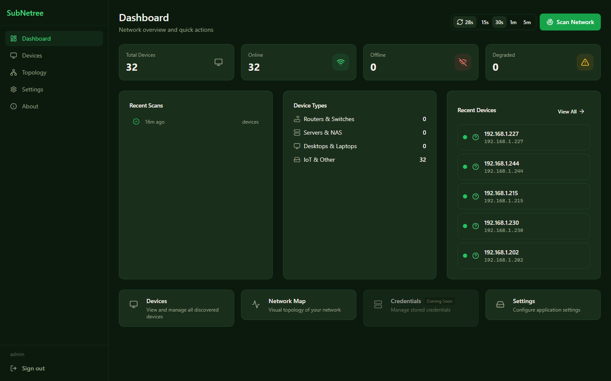
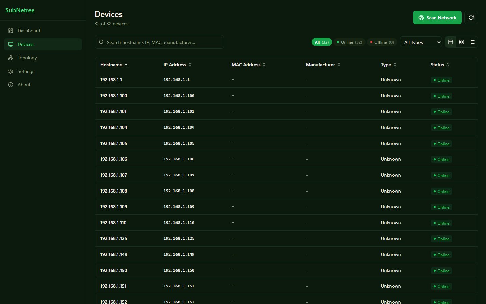
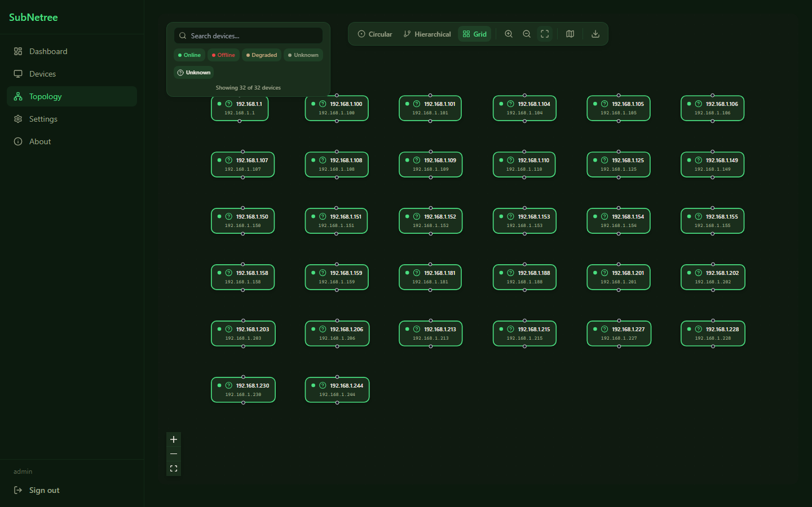
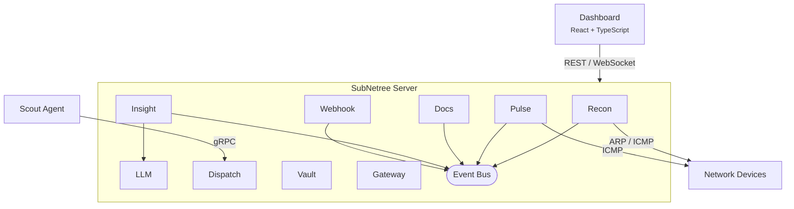

# SubNetree

[](https://github.com/HerbHall/subnetree/actions/workflows/ci.yml)
[](https://github.com/HerbHall/subnetree/releases)
[](https://go.dev/)
[](https://goreportcard.com/report/github.com/HerbHall/subnetree)
[](https://codecov.io/gh/HerbHall/subnetree)
[](https://github.com/HerbHall/subnetree/pkgs/container/subnetree)
[](LICENSE)

> All core modules are functional. Discovery, monitoring, analytics, credential vault, and remote access all work. Contributions and feedback welcome!

**Your HomeLab command center.** SubNetree discovers devices on your network, monitors their status, and gives you one-click access to everything -- without typing passwords a thousand times a day.

## Why SubNetree?

HomeLabbers juggle dozens of tools: UnRAID for storage, Proxmox for VMs, Home Assistant for automation, plus routers, NAS boxes, and random IoT devices. SubNetree doesn't replace any of them -- it's your **dashboard and aggregator** that:

- **Discovers everything** on your LAN automatically (ARP, ICMP -- with mDNS, SNMP, UPnP planned)
- **Shows status at a glance** from multiple platforms in one place
- **Launches anything** with one click -- web UIs, SSH -- credentials handled
- **Extends via plugins** to monitor whatever you need

## Screenshots

### Dashboard Overview



### Device Discovery



### Network Topology



## What You'll Need

- **A computer on your network** running Docker (Linux, macOS, or Windows)
- **Docker** installed and running ([Get Docker](https://docs.docker.com/get-docker/))
- **5 minutes** for initial setup

That's it. No databases, no config files, no dependencies to install.

## Quick Start

```console
docker run -d --name subnetree -p 8080:8080 -v subnetree-data:/data ghcr.io/herbhall/subnetree:latest
```

Open [http://localhost:8080](http://localhost:8080) -- the setup wizard will guide you through creating an admin account.

<details>
<summary>Using host networking (Linux only -- recommended for full discovery)</summary>

Host networking gives SubNetree direct access to your LAN for ARP/ICMP device discovery. This is the recommended setup for Linux home servers:

```console
docker run -d --name subnetree --network host -v subnetree-data:/data ghcr.io/herbhall/subnetree:latest
```

> **Note:** `--network host` is not supported on Docker Desktop (macOS/Windows). Use the default bridge command above instead.

</details>

### Docker Compose

See [docker-compose.yml](docker-compose.yml) for a ready-to-use Compose file:

```console
docker compose up -d
```

## Features

### Discovery and Mapping

- Finds every device on your network automatically (ARP + ICMP scanning with manufacturer identification)
- Identifies device type, operating system, and brand from MAC addresses (OUI lookup + reverse DNS)
- Interactive network topology map showing how devices connect
- Full device inventory with search, categorization, and bulk operations

### Monitoring and Alerts

- Tracks device health in real time with automatic alerting (OK / Warning / Critical states)
- Alerts you when device behavior changes (statistical anomaly detection with EWMA baselines, Z-score, and CUSUM)
- Predicts trends before problems happen (linear regression forecasting)
- Ask questions about your network in plain English via local AI (Ollama integration)
- Plugin-extensible -- monitor anything

### Secure Credential Storage

- Bank-level encryption for stored credentials (AES-256-GCM envelope encryption, Argon2id key derivation)
- Supports 7 credential types with automatic key rotation
- Seal/unseal model -- credentials are locked until you unlock the vault

### Remote Access

- Launch any device's web UI or SSH session with one click -- no re-typing passwords
- Browse remote services through a built-in reverse proxy (HTTP)
- SSH-in-browser via WebSocket with full session audit trail

### Infrastructure Documentation

- Discovers Docker containers and captures their configuration automatically
- Tracks configuration changes over time with snapshot versioning and retention policies
- Side-by-side diff viewer for spotting exactly what changed (LCS-based comparison)

### Dashboard and Authentication

- Modern, responsive dashboard with device list, detail pages, and topology view
- Dark mode, keyboard shortcuts, and real-time scan progress via WebSocket
- Secure login with automatic session management (JWT-based authentication)
- First-run setup wizard -- no manual configuration needed
- Backup and restore your data with a single CLI command
- Ready-to-run Docker image with health checks

### Coming Next

- Enhanced discovery: mDNS, UPnP, LLDP/CDP
- Additional LLM providers: OpenAI, Anthropic
- Multi-tenant support for MSPs
- Tailscale integration

See the [phased roadmap](docs/requirements/21-phased-roadmap.md) for the full plan.

## Guides

- [Development Setup](docs/guides/development-setup.md) -- local dev environment
- [Tailscale Deployment](docs/guides/tailscale-deployment.md) -- running SubNetree + Scout over Tailscale
- [Tailscale Serve & Funnel](docs/guides/tailscale-funnel.md) -- exposing the dashboard without port forwarding

## Troubleshooting

**Docker: Scanning finds no devices** --
Use host networking for full ARP/ICMP access:

```bash
docker run -d --network host -v subnetree-data:/data ghcr.io/herbhall/subnetree:latest
```

Or ensure `NET_RAW` and `NET_ADMIN` capabilities are set.

**First-time setup** --
Navigate to `http://localhost:8080` -- the setup wizard will prompt you to create an admin account.

**Backup your data** --

```bash
# Create backup
subnetree backup --data-dir /data --output my-backup.tar.gz

# Restore from backup
subnetree restore --input my-backup.tar.gz --data-dir /data --force
```

## How SubNetree Compares

| | SubNetree | Zabbix | LibreNMS | Uptime Kuma | Domotz |
| --- | :---: | :---: | :---: | :---: | :---: |
| **Auto-Discovery** | ARP + ICMP | SNMP/agent | SNMP | -- | Proprietary |
| **Dashboard** | Modern React | Dated PHP | Bootstrap | Clean | Cloud |
| **Topology Map** | Interactive | Static | Auto | -- | Auto |
| **Agent Optional** | Yes | Recommended | Recommended | -- | Required |
| **Setup Time** | ~2 min | Hours | 30+ min | ~5 min | ~10 min |
| **Self-Hosted** | Yes | Yes | Yes | Yes | No |
| **License** | BSL 1.1* | GPL-2.0 | GPL-3.0 | MIT | Proprietary |
| **Target User** | HomeLabbers | Enterprise | Enterprise | Uptime only | MSPs |

*BSL 1.1 converts to Apache 2.0 after 4 years. Free for personal/HomeLab use.

## Community

- [GitHub Discussions](https://github.com/HerbHall/subnetree/discussions) -- questions, ideas, and general chat
- [Issue Tracker](https://github.com/HerbHall/subnetree/issues) -- bug reports and feature requests
- [Contributing Guide](CONTRIBUTING.md) -- how to get involved

New here? Check out the [Welcome thread](https://github.com/HerbHall/subnetree/discussions/114) or share your setup in [Show Your Setup](https://github.com/HerbHall/subnetree/discussions/117).

## Support the Project

SubNetree is **free for personal, HomeLab, and non-competing production use**. If you find it useful:

- [GitHub Sponsors](https://github.com/sponsors/HerbHall)
- [Ko-fi](https://ko-fi.com/herbhall)
- [Buy Me a Coffee](https://buymeacoffee.com/herbhall)

You can also contribute by [reporting bugs](https://github.com/HerbHall/subnetree/issues), [requesting features](https://github.com/HerbHall/subnetree/discussions), testing alpha releases, or building plugins.

---

<!-- Everything below this line is for contributors and developers -->

## Development

### Architecture



### Modules

| Module | Description |
| --- | --- |
| **Recon** | Network scanning and device discovery |
| **Pulse** | Health monitoring, metrics, alerting |
| **Docs** | Infrastructure documentation, config snapshots, diffing |
| **Dispatch** | Scout agent enrollment and management |
| **Vault** | Encrypted credential storage |
| **Gateway** | Browser-based remote access (SSH, HTTP proxy) |
| **Webhook** | Event-driven webhook notifications |
| **LLM** | AI provider integration (Ollama, optional) |
| **Insight** | Statistical analytics, anomaly detection, NL queries |

### Building from Source

**Prerequisites:** Go 1.25+, Node.js 22+, Make (optional)

```bash
# Build everything (server + frontend)
make build

# Or build separately
make build-server
cd web && pnpm install --frozen-lockfile && pnpm run build

# Start server (serves dashboard at :8080)
./bin/subnetree

# With config file
./bin/subnetree -config configs/subnetree.example.yaml

# Run tests
make test

# Run linter
make lint

# Generate protobuf
make proto
```

### Project Structure

```text
cmd/
  subnetree/     Server entry point
  scout/          Agent entry point
internal/
  recon/          Network discovery module
  pulse/          Monitoring module
  docs/           Infrastructure documentation module
  dispatch/       Agent management module
  vault/          Credential management module
  gateway/        Remote access module
  webhook/        Webhook notification module
  llm/            LLM plugin (Ollama provider)
  insight/        Analytics and anomaly detection
web/              React dashboard (Vite + shadcn/ui)
pkg/
  plugin/         Public plugin SDK (Apache 2.0)
  llm/            LLM provider interface (Apache 2.0)
  roles/          Plugin role definitions (Apache 2.0)
  models/         Shared data types
api/
  proto/v1/       gRPC service definitions
```

### Roadmap

- **v0.2.1** (shipped): Core modules -- monitoring, analytics, vault, gateway, LLM
- **v0.3.0** (next): Scout agents, mTLS, SNMP discovery, service mapping, monitoring dashboard
- **v0.4.0**: Enhanced discovery (mDNS, UPnP, LLDP/CDP), multi-tenant support
- **v1.0.0**: PostgreSQL, MFA, OIDC, HomeLab integrations

## License

SubNetree uses a split licensing model:

- **Core** (server, agent, built-in modules): [Business Source License 1.1](LICENSE) -- free for personal, HomeLab, educational, and non-competing production use. Converts to Apache 2.0 after 4 years.
- **Plugin SDK** (`pkg/plugin/`, `pkg/roles/`, `pkg/models/`, `api/proto/`): [Apache License 2.0](pkg/plugin/LICENSE) -- build plugins and integrations with no restrictions.

See [LICENSING.md](LICENSING.md) for full details.
