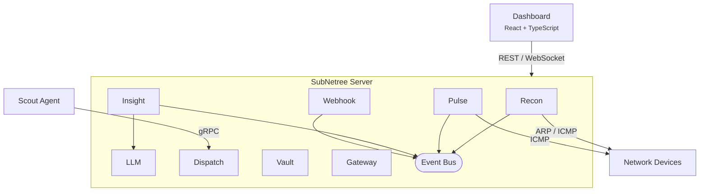

# SubNetree

[](https://github.com/HerbHall/subnetree/actions/workflows/ci.yml)
[](https://github.com/HerbHall/subnetree/releases)
[](https://goreportcard.com/report/github.com/HerbHall/subnetree)
[](https://codecov.io/gh/HerbHall/subnetree)
[](LICENSE)

> **v0.2.1**: All core modules are functional. Discovery, monitoring, analytics, credential vault, and remote access all work. Contributions and feedback welcome!

**Your HomeLab command center.** SubNetree discovers devices on your network, monitors their status, and gives you one-click access to everything -- without typing passwords a thousand times a day.

## Why SubNetree?

HomeLabbers juggle dozens of tools: UnRAID for storage, Proxmox for VMs, Home Assistant for automation, plus routers, NAS boxes, and random IoT devices. SubNetree doesn't replace any of them -- it's your **dashboard and aggregator** that:

- **Discovers everything** on your LAN automatically (ARP, ICMP -- with mDNS, SNMP, UPnP planned)
- **Shows status at a glance** from multiple platforms in one place
- **Launches anything** with one click -- web UIs, SSH -- credentials handled
- **Extends via plugins** to monitor whatever you need

## Current Status

> **v0.2.1** -- All core modules functional. 398 tests across 5 new modules.

### What Works Today

- **Network Discovery**: ARP + ICMP scanning with OUI manufacturer lookup and reverse DNS
- **Device Monitoring**: ICMP health checks, alert state machine (OK/Warning/Critical), data retention
- **AI-Powered Analytics**: EWMA baselines, Z-score anomaly detection, CUSUM change-point detection, linear regression forecasting, natural language queries via Ollama
- **Credential Vault**: AES-256-GCM envelope encryption, Argon2id key derivation, seal/unseal model, 7 credential types, key rotation
- **Remote Access Gateway**: HTTP reverse proxy, SSH-in-browser via WebSocket, session management with audit trail
- **Interactive Dashboard**: Device list, detail pages, topology visualization, dark mode, keyboard shortcuts
- **Real-Time Updates**: WebSocket-powered scan progress with live device feed
- **Authentication**: JWT-based auth with first-run setup wizard
- **Backup/Restore**: CLI commands for data safety
- **Docker**: Multi-stage builds with health checks

### Coming Next

- Scout agents for detailed host metrics (v0.3.0)
- Enhanced discovery: SNMP, mDNS, UPnP, LLDP/CDP (v0.4.0)
- Additional LLM providers: OpenAI, Anthropic (v0.3.0+)
- Multi-tenant support for MSPs (v0.5.0)

See the [phased roadmap](docs/requirements/21-phased-roadmap.md) for the full plan.

## Screenshots

### Dashboard Overview


### Device Discovery


### Network Topology


## Quick Start (Docker)

```console
docker run -d --name subnetree -p 8080:8080 -v subnetree-data:/data --cap-add NET_RAW --cap-add NET_ADMIN ghcr.io/herbhall/subnetree:latest
```

Open <http://localhost:8080> -- first-time setup will prompt you to create an admin account.

For full network scanning capability on home networks:

```console
docker run -d --name subnetree --network host -v subnetree-data:/data ghcr.io/herbhall/subnetree:latest
```

### Docker Compose

```yaml
# docker-compose.yml
services:
  subnetree:
    image: ghcr.io/herbhall/subnetree:latest
    container_name: subnetree
    restart: unless-stopped
    ports:
      - "8080:8080"
    volumes:
      - subnetree-data:/data
    cap_add:
      - NET_RAW
      - NET_ADMIN

volumes:
  subnetree-data:
```

```bash
docker-compose up -d
```

## Features

### Discovery & Mapping

- LAN scanning with ARP and ICMP (mDNS, SNMP, UPnP in Phase 2)
- Automatic device identification (OS, manufacturer, type)
- Network topology visualization

### Monitoring

- Device health and status tracking
- Scout agents for detailed host metrics (coming in v0.3.0)
- Plugin-extensible -- monitor anything

### Quick Access

- One-click launch to web UIs and SSH sessions
- Credential vault so you don't re-type passwords
- HTTP reverse proxy and SSH-in-browser via WebSocket

## How SubNetree Compares

| | SubNetree | Zabbix | LibreNMS | Uptime Kuma | Domotz |
| --- | :---: | :---: | :---: | :---: | :---: |
| **Auto-Discovery** | ARP + ICMP | SNMP/agent | SNMP | -- | Proprietary |
| **Dashboard** | Modern React | Dated PHP | Bootstrap | Clean | Cloud |
| **Topology Map** | Interactive | Static | Auto | -- | Auto |
| **Agent Optional** | Yes | Recommended | Recommended | -- | Required |
| **Setup Time** | ~2 min | Hours | 30+ min | ~5 min | ~10 min |
| **Self-Hosted** | Yes | Yes | Yes | Yes | No |
| **License** | BSL 1.1* | GPL-2.0 | GPL-3.0 | MIT | Proprietary |
| **Target User** | HomeLabbers | Enterprise | Enterprise | Uptime only | MSPs |

*BSL 1.1 converts to Apache 2.0 after 4 years. Free for personal/HomeLab use.

## Architecture



### Modules

| Module | Description |
| --- | --- |
| **Recon** | Network scanning and device discovery |
| **Pulse** | Health monitoring, metrics, alerting |
| **Dispatch** | Scout agent enrollment and management |
| **Vault** | Encrypted credential storage |
| **Gateway** | Browser-based remote access (SSH, HTTP proxy) |
| **Webhook** | Event-driven webhook notifications |
| **LLM** | AI provider integration (Ollama, optional) |
| **Insight** | Statistical analytics, anomaly detection, NL queries |

## Building from Source

### Prerequisites

- Go 1.25+
- Node.js 22+ (for frontend)
- Make (optional)

### Build

```bash
# Build everything (server + frontend)
make build

# Or build separately
make build-server
cd web && pnpm install --frozen-lockfile && pnpm run build
```

### Run

```bash
# Start server (serves dashboard at :8080)
./bin/subnetree

# With config file
./bin/subnetree -config configs/subnetree.example.yaml
```

### Development

```bash
# Run tests
make test

# Run linter
make lint

# Generate protobuf
make proto
```

## Project Structure

```text
cmd/
  subnetree/     Server entry point
  scout/          Agent entry point
internal/
  recon/          Network discovery module
  pulse/          Monitoring module
  dispatch/       Agent management module
  vault/          Credential management module
  gateway/        Remote access module
  webhook/        Webhook notification module
  llm/            LLM plugin (Ollama provider)
  insight/        Analytics and anomaly detection
web/              React dashboard (Vite + shadcn/ui)
pkg/
  plugin/         Public plugin SDK (Apache 2.0)
  llm/            LLM provider interface (Apache 2.0)
  roles/          Plugin role definitions (Apache 2.0)
  models/         Shared data types
api/
  proto/v1/       gRPC service definitions
```

## Roadmap

- **v0.2.1** (shipped): All core modules -- monitoring, analytics, vault, gateway, LLM
- **v0.3.0**: Windows Scout agent + gRPC mTLS + Dispatch
- **v0.4.0**: Enhanced discovery (SNMP, mDNS, UPnP, LLDP/CDP) + alerting
- **v0.5.0**: Multi-tenant support for MSPs
- **v1.0.0**: PostgreSQL, MFA, OIDC, HomeLab integrations (Home Assistant, UnRAID, Proxmox)

## Troubleshooting

**Docker: Scanning finds no devices** --
Use host networking for full ARP/ICMP access:

```bash
docker run -d --network host -v subnetree-data:/data ghcr.io/herbhall/subnetree:latest
```

Or ensure `NET_RAW` and `NET_ADMIN` capabilities are set.

**First-time setup** --
Navigate to `http://localhost:8080` -- the setup wizard will prompt you to create an admin account.

**Backup your data** --

```bash
# Create backup
subnetree backup --data-dir /data --output my-backup.tar.gz

# Restore from backup
subnetree restore --input my-backup.tar.gz --data-dir /data --force
```

## Guides

- [Development Setup](docs/guides/development-setup.md) -- local dev environment
- [Tailscale Deployment](docs/guides/tailscale-deployment.md) -- running SubNetree + Scout over Tailscale
- [Tailscale Serve & Funnel](docs/guides/tailscale-funnel.md) -- exposing the dashboard without port forwarding

## Community

- [GitHub Discussions](https://github.com/HerbHall/subnetree/discussions) -- questions, ideas, and general chat
- [Issue Tracker](https://github.com/HerbHall/subnetree/issues) -- bug reports and feature requests
- [Contributing Guide](CONTRIBUTING.md) -- how to get involved

New here? Check out the [Welcome thread](https://github.com/HerbHall/subnetree/discussions/114) or share your setup in [Show Your Setup](https://github.com/HerbHall/subnetree/discussions/117).

## Support the Project

SubNetree is **free for personal, HomeLab, and non-competing production use**. If you find it useful:

- [GitHub Sponsors](https://github.com/sponsors/HerbHall)
- [Ko-fi](https://ko-fi.com/herbhall)
- [Buy Me a Coffee](https://buymeacoffee.com/herbhall)

You can also contribute by [reporting bugs](https://github.com/HerbHall/subnetree/issues), [requesting features](https://github.com/HerbHall/subnetree/discussions), testing alpha releases, or building plugins.

## License

SubNetree uses a split licensing model:

- **Core** (server, agent, built-in modules): [Business Source License 1.1](LICENSE) -- free for personal, HomeLab, educational, and non-competing production use. Converts to Apache 2.0 after 4 years.
- **Plugin SDK** (`pkg/plugin/`, `pkg/roles/`, `pkg/models/`, `api/proto/`): [Apache License 2.0](pkg/plugin/LICENSE) -- build plugins and integrations with no restrictions.

See [LICENSING.md](LICENSING.md) for full details.
