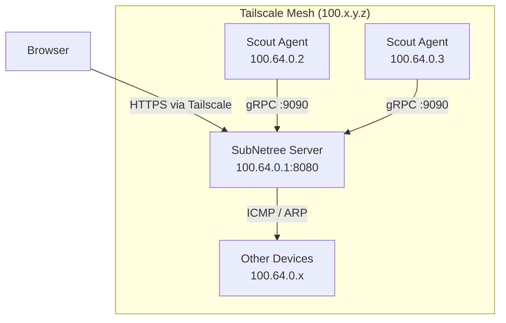

# Running SubNetree over Tailscale

This guide explains how to run SubNetree and Scout agents across a distributed
HomeLab using [Tailscale](https://tailscale.com) as the overlay network.

## Why Tailscale?

Tailscale creates a WireGuard-based mesh VPN (called a "tailnet") between your
devices. Each device gets a stable `100.x.y.z` address that works regardless of
NAT, firewalls, or physical location. This makes it ideal for HomeLabs spread
across multiple sites -- a NAS at home, a Pi at a parent's house, a VPS in the
cloud -- all reachable as if they were on the same LAN.

SubNetree benefits from Tailscale in two ways:

1. **The server** becomes reachable from any tailnet device without port
   forwarding
2. **Scout agents** on remote nodes can connect back to the server over stable
   Tailscale IPs

## Prerequisites

- Tailscale installed on every device that needs to communicate
  ([install guide](https://tailscale.com/download))
- A Tailscale account (free for personal use, up to 100 devices)
- SubNetree server binary or Docker image
- Scout agent binary (optional, for remote host monitoring)

## Network Topology



## Step 1: Install Tailscale on the Server Host

Follow the [Tailscale install guide](https://tailscale.com/download) for your
OS. After installation:

```bash
# Authenticate and join your tailnet
tailscale up

# Verify your Tailscale IP
tailscale ip -4
# Example output: 100.64.0.1
```

Note your server's Tailscale IP -- Scout agents will use this to connect.

## Step 2: Run SubNetree Server

### Option A: Docker (Recommended)

```bash
docker run -d --name subnetree \
  --network host \
  -v subnetree-data:/data \
  ghcr.io/herbhall/subnetree:latest
```

Host networking gives SubNetree access to both the Tailscale interface and your
local LAN for scanning.

### Option B: Binary

```bash
./subnetree --config subnetree.yaml
```

With a config that binds to all interfaces:

```yaml
server:
  host: "0.0.0.0"
  port: 8080
```

Binding to `0.0.0.0` (the default) means SubNetree listens on both the LAN
interface and the Tailscale interface. To restrict access to Tailscale only,
bind to your Tailscale IP:

```yaml
server:
  host: "100.64.0.1"  # Replace with your Tailscale IP
  port: 8080
```

## Step 3: Verify Server Access

From any device on your tailnet:

```bash
# Replace with your server's Tailscale IP
curl http://100.64.0.1:8080/api/v1/health
```

You should see a JSON health response. You can also open
`http://100.64.0.1:8080` in a browser to access the dashboard.

## Step 4: Install Scout Agents (Optional)

On each remote device you want to monitor:

```bash
# Install Tailscale (if not already done)
tailscale up

# Run Scout, pointing at the server's Tailscale IP
./scout --server 100.64.0.1:9090 --interval 30
```

Scout uses gRPC with mTLS for secure communication. Over Tailscale, traffic is
already encrypted by WireGuard, providing defense in depth.

### Docker Scout

```bash
docker run -d --name scout \
  --network host \
  ghcr.io/herbhall/scout:latest \
  --server 100.64.0.1:9090
```

## Step 5: Configure Tailscale ACLs (Optional)

By default, Tailscale allows all traffic between devices on your tailnet. For
tighter security, configure
[ACLs](https://tailscale.com/kb/1018/acls) to restrict which devices can reach
SubNetree:

```jsonc
// Example: Only tagged devices can reach the server
{
  "acls": [
    {
      "action": "accept",
      "src": ["tag:homelab"],
      "dst": ["tag:subnetree-server:8080", "tag:subnetree-server:9090"]
    }
  ],
  "tagOwners": {
    "tag:homelab": ["autogroup:admin"],
    "tag:subnetree-server": ["autogroup:admin"]
  }
}
```

Then tag your devices:

```bash
# On the server
tailscale up --advertise-tags=tag:subnetree-server

# On monitored devices
tailscale up --advertise-tags=tag:homelab
```

## Step 6: Scanning Remote Subnets

SubNetree's Recon module scans the local subnet by default. Devices on remote
sites behind other Tailscale nodes are not directly scannable unless you set up
a [subnet router](https://tailscale.com/kb/1019/subnets):

```bash
# On a device at the remote site, advertise the local subnet
tailscale up --advertise-routes=192.168.1.0/24
```

Then approve the route in the Tailscale admin console. SubNetree can then scan
`192.168.1.0/24` as if it were local.

## Ports Reference

| Port | Protocol | Purpose |
| --- | --- | --- |
| 8080 | HTTP | Dashboard and REST API |
| 9090 | gRPC | Scout agent communication |

## Troubleshooting

**Cannot reach server from remote device** -- Verify both devices are on the
same tailnet with `tailscale status`. Check that the server's firewall allows
traffic on ports 8080 and 9090.

**Docker container cannot see Tailscale interface** -- Use `--network host` so
the container shares the host's network stack (including the Tailscale
interface).

**Scanning finds only local devices** -- SubNetree scans the local subnet. For
remote subnets, configure Tailscale subnet routes (see Step 6).

**MagicDNS names not resolving** -- Enable
[MagicDNS](https://tailscale.com/kb/1081/magicdns) in the Tailscale admin
console. You can then access SubNetree at
`http://your-server-hostname:8080` instead of the IP.
